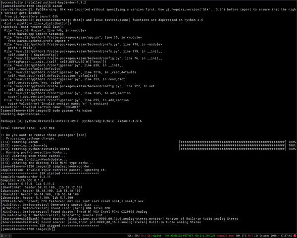
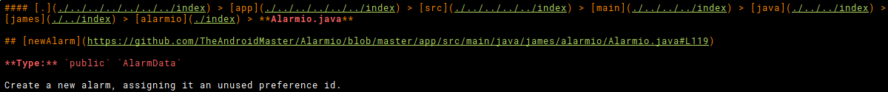

Markdown Javadoc is a script that generates markdown-based javadocs primarily for use in Jekyll and GitHub Pages. It consists of two modules, a [CLI](#cli) and an [API](#api) (the API is a dependency of the CLI). If you simply want to generate a set of javadocs in markdown without any scripting, the CLI provides a simple interface with a decent amount of options. If you have a more complex use case, however, it might be more beneficial to look into the API first.



An example of these pages in action can be found [here](https://jfenn.me/projects/alarmio/docs/) as well as in some of the other projects on my site.



The installation instructions are fairly similar for both modules. They are distributed through the [Node Package Manager](https://docs.npmjs.com/getting-started/what-is-npm), but can also be compiled from source. All of these instructions will take place on your command line.

## CLI

### Installation

#### NPM

```shell
sudo npm install -g mdjavadoc
```

#### From Source

```shell
git clone https://github.com/TheAndroidMaster/mdjavadoc
cd mdjavadoc/cli
npm install
sudo npm link
```

### Usage

The CLI is fairly simple. Running it generates docs relative to the current directory, and the result can be changed using the arguments below. The contents of the `mdjavadoc --help` command are as follows:

```
Usage: mdjavadoc [options]

Options:

  -v --version                output the version number
  -o --output [path]		      location to output generated files in
  -f --file [file]            a specific file to parse
  -t --template [file]        a template to use for generated files
  -e --extensions             generate files with extensions
  --filter [expression]       file name filter
  --dirfilter [expression]    dir name filter
  --prefix [url]              source code prefix
  -b --breadcrumbs [char]        generate breadcrumbs
  -i --index [name]              generate index files with the given name
  --index-length [length]     number of directories for internal index files to look into
  --index-template [file]     a template to use for index files
  --index-extensions          include extensions in index files
  -h --help                   output usage information
```

#### Arguments

##### `--output`

By default, `mdjavadoc` parses every file (that doesn't start with a `.`) in the current directory and outputs the generated markdown in `./docs`. Specifying the `--output` argument changes this directory.

##### `--file`

Since `mdjavadoc`'s default behavior is to parse every file in the current directory, the `--file` argument has no default behavior. If it is specified, the `--output` argument is no longer used as an output *directory* and can instead be used to specify the file to output markdown into. If `--output` is not specified, the output file name defaults to the name of the parsed file + ".md".

##### `--template`

This allows you to specify a template file to use for all of the markdown docs generated by the program. Any occurrence of the text `{{ content }}` surrounded by whitespace will be replaced with the generated markdown docs.

##### `--extensions`

This is used to specify whether extensions should be included in the output file names (the default is no). If this is specified, the markdown file for "ClassName.java" will become "ClassName.java.md" instead of just "ClassName.md".

##### `--filter`

This argument can be used to specify a RegEx statement to filter out unwanted files to parse in a directory. This argument defaults to `/^(?!\.).*/`, which will exclude any file name which begins with a ".". If you wanted to exclude all files except those which end in `.java`, you could set this argument to `".*(\\.java)$"`; likewise for any other file extension.

##### `--dirfilter`

`--filter` but for directories.

##### `--prefix`

This argument is used to specify a prefix to prepend to the source code URLs generated by the program. It defaults to `..`, which you would want if you were placing the docs in a folder with the rest of your source code, but is useless for just about anything else, so you will probably want to change this to your project's complete URL ("https://github.com/user/repository/blob/master").

##### `--breadcrumbs`

Specifying this makes mdjavadoc put "breadcrumbs" at the top of generated files to help with navigation. For example, a file "api/index.js" would be given a breadcrumb like this:

```markdown
[.](../) > [api](.) > **index.js**
```

You can optionally pass a string to this argument to specify what the divider placed between "crumbs" should be. The default is `'>'`.

##### `--index`

Specifying this makes mdjavadoc add index files to each directory containing a list of all the files and directories that the directory contains. Optionally, you can pass a string to this argument, which will be used as the name of the index files (they default to "README.md"). These files do overwrite any doc files, however, so you may want to specify `--extensions` as well if you happen to have a file named "README.js" or something.

The items displayed in the index files of "internal" directories (any directory except root) are limited to "three folders down" by default, but you can specify `--index-length` in addition to this argument to change that.

##### `--index-template`

Works literally the exact same way as `--template` but for index files.

##### `--index-extensions`

Whether to use extensions in the links inside index files.

## API

### Installation

#### NPM

```shell
npm install mdjavadoc-api
```

#### From Source

```shell
git clone https://github.com/TheAndroidMaster/mdjavadoc
cd mdjavadoc/api
npm install
```

See "[Requiring Modules in NodeJS](https://medium.freecodecamp.org/requiring-modules-in-node-js-everything-you-need-to-know-e7fbd119be8) by Samer Buna" for information about how to include local modules in your project.

### Usage

Using the API in your application is pretty easy. For example, this program will parse the file "index.js" and output the resulting markdown to "out.md":

```javascript
const _mdjd = require('mdjavadoc-api');
_mdjd.generateMarkdownFile("index.js", "out.md");
```

Another example, this one simply parses "index.js" and prints the parsed data in the console:

```javascript
const _mdjd = require('mdjavadoc-api');
console.log(_mdjd.parseFile("index.js"));
```

#### Options

The `options` argument of each method is simply an object containing optional arguments which can change the result of the program. These options function as stated below:

| Option Name     | Type             | Description |
|-----------------|------------------|-------------|
| template        | file (string)    | Uses the file as a template to generate markdown, replacing occurences of `{{ content }}` with the generated docs. |
| reg             | RegExp           | A regular expression to filter out unwanted files (defaults to `/^(?!\.).*/`, or "any file that does not begin with a `.`"). |
| regdir          | RegExp           | `reg` but for directories. |
| extensions      | boolean          | Whether to include the file extensions in the generated content (setting this to true will name files "ClassName.java.md" instead of just "ClassName.md") |
| sourcePrefix    | string           | A string to start all source code URLs with. Defaults to "..". For example, a link to "/api/index.js#L50" will become "../api/index.js#L50". |
| breadcrumbs     | boolean          | Whether to add "breadcrumbs" to the top of each file for navigation. |
| breadcrumbsChar | string           | The character to separate breadcrumbs with - defaults to " > ". |
| index           | boolean / string | Whether to generate an index file containing all of the generated docs, and (optionally) the name of the file - defaults to "README.md". By default, this option also generates files for internal directories which look into a smaller amount of folders specified by `indexLength`. |
| indexLength     | integer          | How many directories internal index files should look into - defaults to 3. Setting this value to 0 disables index files for internal directories. |
| indexExtensions | boolean          | Whether to include file extensions (.md, etc) in index files. |
| indexTemplate   | file (string)    | A `template` but for index files. Works almost exactly the same way. |

## Functionality

The program works by searching a set of files for [javadoc comments](https://www.oracle.com/technetwork/java/javase/documentation/index-137868.html), parsing them into a data structure containing the description, tags, and metadata, and then outputting that data into a set of markdown files. For example, a file containing a javadoc comment like the one below would yield the following structure and output...

##### Javadoc

```java
/**
 * This is a method which does a thing with something and stuff.
 * 
 * @param something		This is something.
 * @param stuff			This is a bunch of stuff.
 * @return			A thing.
 */
public static Object doTheThing(int something, String[] stuff) {
	return null;
}
```

##### Data

```javascript
[
  {
    name: "doTheThing",
    description: "This is a method which does a thing with something and stuff.",
    type: ["public", "static", "void"],
    source: "/package/structure/ClassName.java#L2",
    param: [
      {
        content: "@param something\tThis is something.",
        template: ["Parameter Name", "Description"],
        values: ["something", "This is something."]
      },
      {
        content: "@param stuff\t\tThis is a bunch of stuff.",
        template: ["Parameter Name", "Description"],
        values: ["stuff", "This is a bunch of stuff."]
      }
    ],
    return: [
      {
        content: "@return\t\tA thing.",
        template: ["Returned Value"],
        values: ["A thing."]
      }
    ]
  }
]
```

##### Markdown

```md
## [doTheThing](../blob/master/package/structure/ClassName.java#L2)

**Type:** `public` `static` `void`

This is a method which does a thing with something and stuff.

|Parameter Name|Description|
|-----|-----|
|something|This is something.|
|stuff|This is a bunch of stuff.|

**Returned Value:** A thing.
```

## License

```
MIT License

Copyright (c) 2018 James Fenn

Permission is hereby granted, free of charge, to any person obtaining a copy
of this software and associated documentation files (the "Software"), to deal
in the Software without restriction, including without limitation the rights
to use, copy, modify, merge, publish, distribute, sublicense, and/or sell
copies of the Software, and to permit persons to whom the Software is
furnished to do so, subject to the following conditions:

The above copyright notice and this permission notice shall be included in all
copies or substantial portions of the Software.

THE SOFTWARE IS PROVIDED "AS IS", WITHOUT WARRANTY OF ANY KIND, EXPRESS OR
IMPLIED, INCLUDING BUT NOT LIMITED TO THE WARRANTIES OF MERCHANTABILITY,
FITNESS FOR A PARTICULAR PURPOSE AND NONINFRINGEMENT. IN NO EVENT SHALL THE
AUTHORS OR COPYRIGHT HOLDERS BE LIABLE FOR ANY CLAIM, DAMAGES OR OTHER
LIABILITY, WHETHER IN AN ACTION OF CONTRACT, TORT OR OTHERWISE, ARISING FROM,
OUT OF OR IN CONNECTION WITH THE SOFTWARE OR THE USE OR OTHER DEALINGS IN THE
SOFTWARE.
```

## Contributing

Contributions are accepted. As this project is updated frequently, it is encouraged to [contact me](mailto:dev@jfenn.me) before working on any changes in order to prevent a [merge conflict](https://help.github.com/articles/about-merge-conflicts/).

In order to contribute to the project, first fork the repository using the "fork" button in the top right corner of the project's GitHub page. Then follow the instructions for installing the CLI from source, replacing the url to this repository with the url of your fork. Once your modifications are finished, you may submit a Pull Request [here](https://github.com/TheAndroidMaster/mdjavadoc/compare).

This project enforces the [Contributor Covenant](https://www.contributor-covenant.org/) code of conduct, along with a general understanding that while constructive debate does benefit the project, we should be aware of our language and not discourage newcomers from offering their feedback or criticism.
